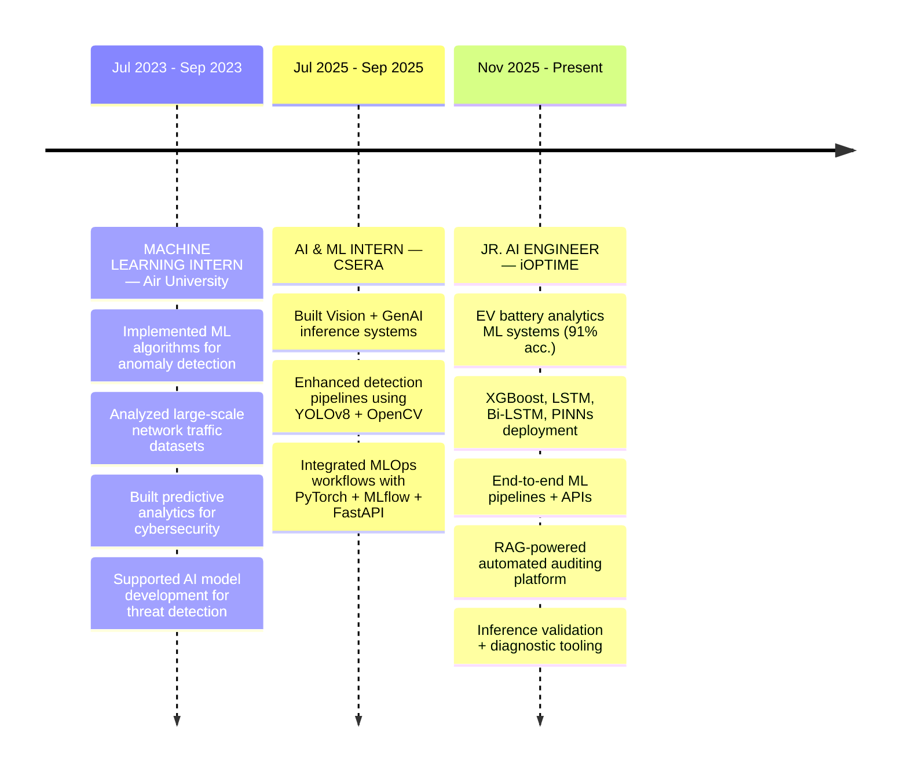
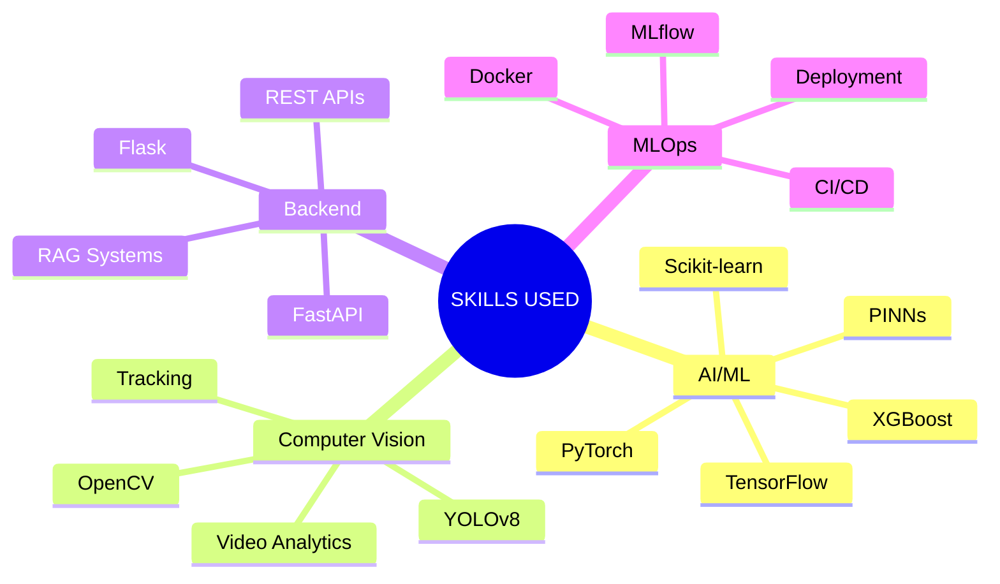

<div align="center">

<!-- Typing Animation as the Hero (no broken image dependency) -->


<a href="https://git.io/typing-svg">
  
</a>

<br/><br/>

<!-- Status badges -->
<p>
  
  
  
</p>

<!-- Portfolio Button with Glow Effect -->
<a href="https://portfolio-xi-pied-gqp3nva0cx.vercel.app/" target="_blank">
  
</a>

</div>

<br/>

---

## `whoami`

```python
class AlyyanAhmed:
    role        = "AI/ML Engineer @ iOPTIME Pvt Ltd"
    location    = "Islamabad, Pakistan"

    focus = [
        "Computer Vision",
        "Agentic LLMs",
        "Production MLOps",
        "EV Battery Analytics",
    ]

    stack = {
        "research_to_prod" : "data -> train -> deploy -> monitor -> iterate",
        "infra"            : ["Docker", "FastAPI", "MLflow", "DVC", "CI/CD"],
        "llm_layer"        : ["LangChain", "LangGraph", "RAG", "Agentic Workflows"],
        "edge"             : ["TFLite", "Raspberry Pi", "Arduino"],
    }

    def now(self):
        return "shipping ML that actually works in production"
```

---

## 🚀 Featured Projects

<table>
<tr>
<td width="50%" valign="top">

### 😀 Facial Emotion Recognition
`ViT` `DVC` `MLflow` `Docker` `Gradio`

End-to-end MLOps pipeline with version control, CI/CD, and live Hugging Face deployment with interactive Gradio interface.

[](https://github.com/AlyyanAhmed21)

</td>
<td width="50%" valign="top">

### 🤖 Agentic SQL Assistant
`LangChain` `LangGraph` `RAG` `MySQL`

Natural language to SQL with real-time analytics. Hybrid RAG + SQL architecture with coaching-style feedback loop.

[](https://github.com/AlyyanAhmed21)

</td>
</tr>
<tr>
<td width="50%" valign="top">

### 🩺 Pneumonia Detection
`TensorFlow` `TFLite` `OpenCV`

Edge-optimised CNN for low-resource environments. Clinical-grade accuracy on mobile and embedded devices.

[](https://github.com/AlyyanAhmed21)

</td>
<td width="50%" valign="top">

### 🫁 Chest X-ray Classification
`PyTorch` `Albumentations` `scikit-learn`

Multi-class transfer learning with advanced augmentation. Full evaluation suite and detailed classification reports.

[](https://github.com/AlyyanAhmed21)

</td>
</tr>
</table>

**Other Notable Work:**
- 🤖 **Smart Cleaning Bot** — Autonomous navigation with real-time edge inference (Raspberry Pi · Arduino · TFLite) → [View](https://github.com/AlyyanAhmed21)

---
<br/>

## 🏆 Kaggle Competitions

> ### 🌾 **Predict Irrigation Need** *(Season 6, Ep 4)*
> **Result:** 🏆 Top 12% Finish (0.9802 Balanced Accuracy OOF)
> * Built a weighted ensemble using XGBoost (GPU) and LightGBM for multiclass irrigation prediction.
> * Engineered advanced features including digit extraction, N-gram composites, and community-inspired “Magic Score” features.
> * Applied in-fold multi-class Target Encoding with weighted augmentation from the original dataset.

> ### 📊 **Predict Customer Churn** *(Season 6, Ep 3)*
> **Result:** 🏆 Top 10% Finish (0.917 AUC)
> * Built a 2-Level Stacking Ensemble combining LightGBM, XGBoost, CatBoost, Ridge, and Pytabkit.
> * Engineered advanced features including Nested Target Encoding, N-grams, and Z-scores.
> * Maintained disciplined 10-fold CV with a Logistic Regression meta-learner.

> ### ❤️ **Predicting Heart Disease** *(Season 6, Ep 2)*
> **Result:** 🎯 Score: 0.955 ROC-AUC
> * Developed a CPU-optimized AutoGluon pipeline keeping training under 6 hours.
> * Utilized L1 & L2 Stacking with Gradient Boosted Trees (XGB/LGBM/Cat).
> * Executed strategic data alignment and sampling of external UCI datasets.

> ### 🩸 **Diabetes Prediction Challenge** *(Season 5, Ep 12)*
> **Result:** 💡 Tabular Data Optimization
> * Handled severe class imbalance using SMOTE and class weights.
> * Trained robust XGBoost & Random Forest ensemble models.
> * Automated hyperparameter tuning via Optuna.
---
<br/>

## 🗂️ WORK // FIELD OPERATIONS

<div align="center">

# FIELD DOSSIER // CAREER LOG

</div>

<br>



<br>

---


---

## 🌱 Current Focus

| Area | Details |
|:--|:--|
| 🤖 **Agentic AI** | Tool use, memory systems, multi-step planning |
| 🏭 **Industrial RAG** | Hybrid RAG + SQL for enterprise scale |
| 🚀 **Scalable ML** | FastAPI, Docker, GPU/TPU deployments |
| 🤖 **Robotics** | Path planning, RL, control systems |
| 💻 **Local LLMs** | vLLM, Ollama, efficient inference |

---

## 🛠️ Tech Arsenal

<div align="center">

**Core ML & AI**<br/>

&nbsp;


<br/><br/>**LLM & Agentic AI**<br/>


<br/><br/>**MLOps and Deployment**<br/>

&nbsp;


<br/><br/>**Hardware, Edge and Databases**<br/>

&nbsp;


</div>

---

## 📊 GitHub Analytics

<div align="center">


</div>

---

## 💬 Let's Connect

<div align="center">

<a href="https://www.linkedin.com/in/alyyan-ahmed-048268363/"></a>
<a href="https://www.kaggle.com/akalyyanahmed"></a>
<a href="mailto:alyyanawan19@gmail.com"></a>
<a href="https://github.com/AlyyanAhmed21"></a>
<a href="https://portfolio2-0-nine-psi.vercel.app/"></a>

<br/><br/>

*Open to collaborations on AI/ML projects, research, and ideas worth building.*

<br/>


<!-- Animated Footer (Deep Charcoal/Black) -->

</div>
